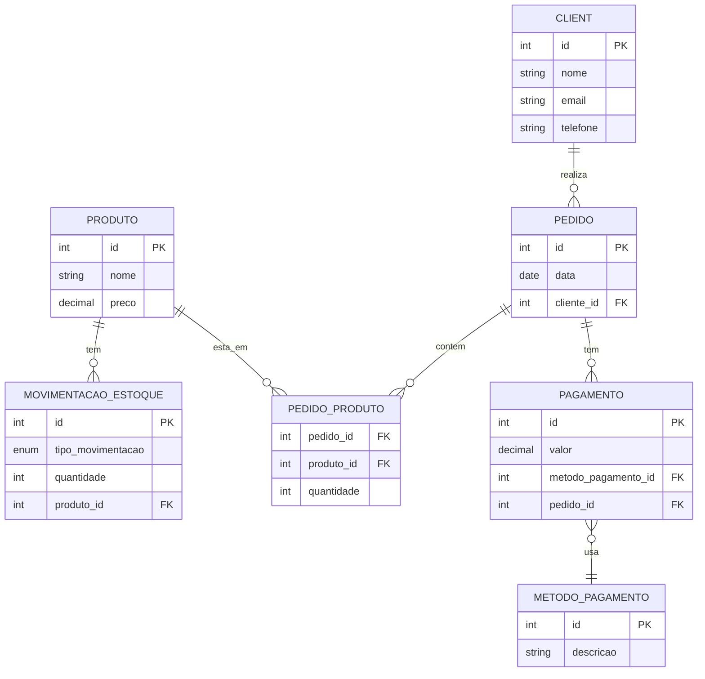

## Desafio 1
### Sistema de Mercado

### **Proposta:**
Você foi contratado para modelar o banco de dados de um mercado. O sistema deve armazenar informações sobre clientes, produtos, pedidos e pagamentos.

- Um cliente pode realizar vários pedidos, mas um pedido pertence a apenas um cliente.
- Cada pedido pode conter vários produtos e cada produto pode estar presente em vários pedidos.
- O pedido também registra a quantidade de cada produto.
- Cada pedido é associado a um ou mais pagamentos, e cada pagamento pertence a apenas um pedido.
- Um cliente pode utilizar diferentes métodos de pagamento (cartão, dinheiro, etc.) para diferentes pedidos.

**Tarefa:**
1. Identifique as principais entidades do sistema.
2. Defina os relacionamentos entre essas entidades.
3. Construa um diagrama ER que represente as entidades, atributos e relacionamentos.

### **Desenvolvimento e Solução**
1. Identificando as Principais Entidades:
   - Cliente
   - Produto
   - Pedido
   - Pagamento
   - Movimentacao_Estoque
   - Metodo_Pagamento
   - Pedido_Pagamento

2. Definir Relacionamentos:
   - Cliente | 1 ----- realiza ----- 0.* | Pedido
   - Pedido | 1 ----- contém ----- 0.* | Pedido_Produto
   - Produto | 1 ----- está em ----- 0.* | Pedido_Produto
   - Produto | 1 ----- tem ----- 0.* | Movimentacao_Estoque
   - Pedido | 1 ----- tem ----- 0.* | Pagamento
   - Pagamento | 0.* ----- usa ----- | Metodo_Pagamento

3. Diagrama ER:
   

4. Banco Relacional:
   
   Criei também o script para criar fisicamente as tabelas do banco de dados nesse [link](create-tables.sql)
