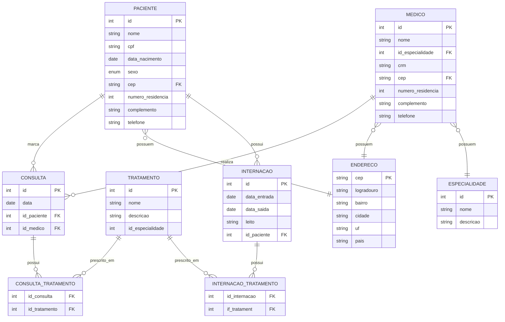

# Desafio 2

## Sistema Hospitalar

### **Descrição:** 
Você foi designado para modelar o banco de dados de um hospital. O sistema deve controlar os pacientes, médicos, consultas e tratamentos.

- Um paciente pode marcar várias consultas, mas uma consulta pertence a apenas um paciente.
- Cada consulta é realizada por um único médico, mas um médico pode realizar várias consultas.
- Uma consulta pode ter um ou mais tratamentos prescritos, e cada tratamento pode ser prescrito em várias consultas.
- Um paciente pode ter várias internações, e uma internação está associada a apenas um paciente.
  
### **Tarefas**
1. Identifique as principais entidades do sistema hospitalar.
2. Defina os relacionamentos entre essas entidades.
3. Construa um diagrama ER que represente as entidades, atributos e relacionamentos do sistema.

### **Desenvolvmento e Soluções**

1. Identificar as principais entidades:
   
   - Paciente
   - Medico
   - Consulta
   - Tratamento
   - Internacao
  
2. Definir relacionamentos:
   
   - Paciente | 1 ----- Marca ----- 0.* | Consulta
   - Medico | 1 ----- Realiza ----- 0.* | Consulta
   - Consulta | 1 ----- Possui ----- 1.* | Tratamento
   - Tratamento | 1 ----- Prescrito em ----- | Consulta
   - Paciente | 1 ----- Tem ----- 0.* | Internacao
   - Internacao | 1 ----- Tem ----- 0.* | Tratamento
   - Tratamento | 1 ----- Prescrito em ----- 0.* | Internacao

3. Identificar entidades secundarias/apoio:
   - Consulta_Tratamento
   - Internacao_Tratamento
   - Endereco
   - Especialidade
  
4. Diagrama ER:

