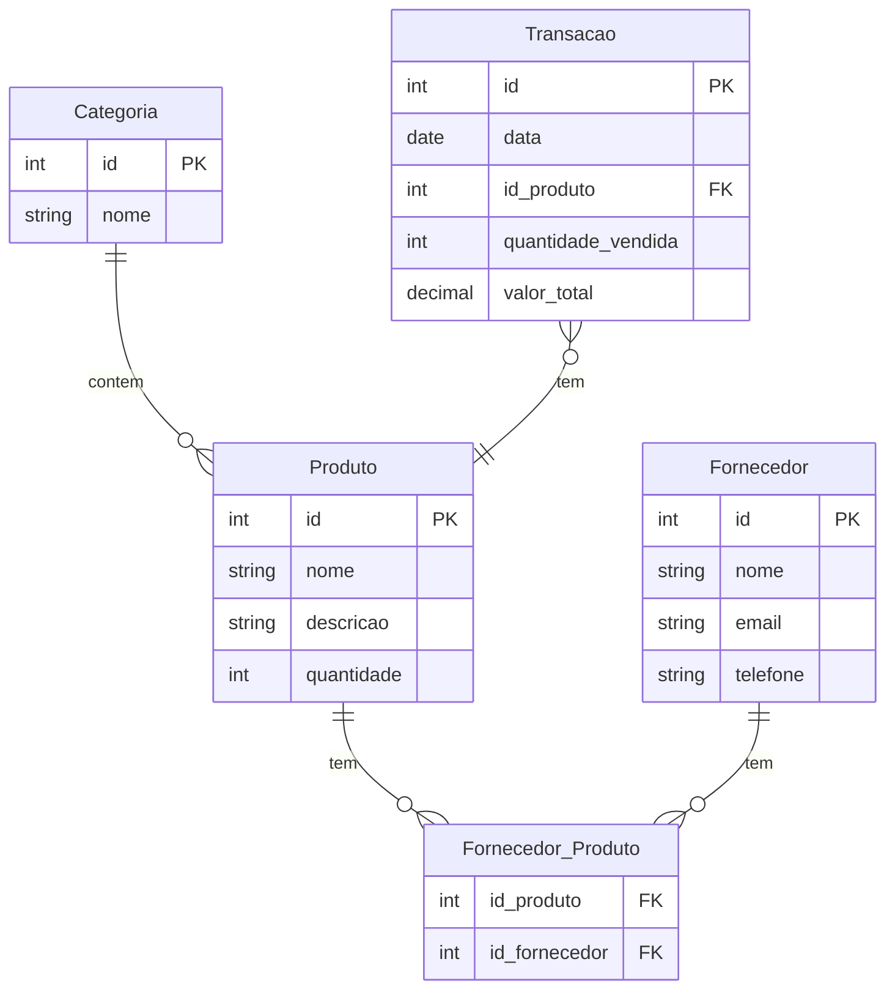
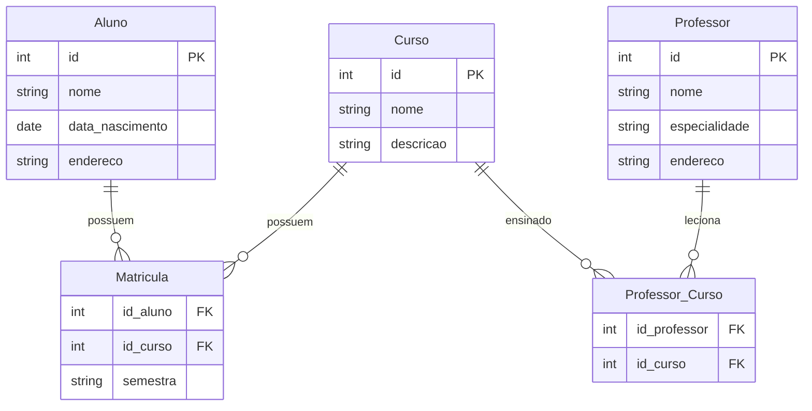

Desafio

### Exercício 1: Sistema de Estoque

*Descrição:*

Você está projetando um sistema de gerenciamento de estoque para uma loja de eletrônicos. O sistema deve acompanhar os produtos em estoque, suas categorias, os fornecedores e as transações de venda.

*Requisitos:*

1. *Produto:* Cada produto tem um ID único, nome, descrição, preço e quantidade em estoque.
2. *Categoria:* Cada produto pertence a uma categoria. Uma categoria tem um ID único e um nome.
3. *Fornecedor:* Cada fornecedor tem um ID único, nome e informações de contato (telefone, e-mail).
4. *Transação:* Cada transação de venda deve registrar o ID da transação, a data, o ID do produto, a quantidade vendida e o valor total da transação.
5. *Fornecedor_Produto:* Produtos podem ser fornecidos por vários fornecedores e cada fornecedor pode fornecer vários produtos. Essa relação deve ser modelada.

*Diagrama ER*

### Exercício 2: Sistema Escolar

*Descrição:*

Você está projetando um sistema de gerenciamento para uma escola. O sistema deve registrar informações sobre alunos, professores, cursos e matrículas.

*Requisitos:*

1. *Aluno:* Cada aluno tem um ID único, nome, data de nascimento e endereço.
2. *Professor:* Cada professor tem um ID único, nome, especialidade e endereço.
3. *Curso:* Cada curso tem um ID único, nome e descrição.
4. *Matrícula:* Cada matrícula deve registrar o ID do aluno, o ID do curso e o semestre em que o curso é oferecido.
5. *Professor_Curso:* Cada professor pode lecionar vários cursos e cada curso pode ter vários professores. Essa relação deve ser modelada.

*Diagrama ER*

